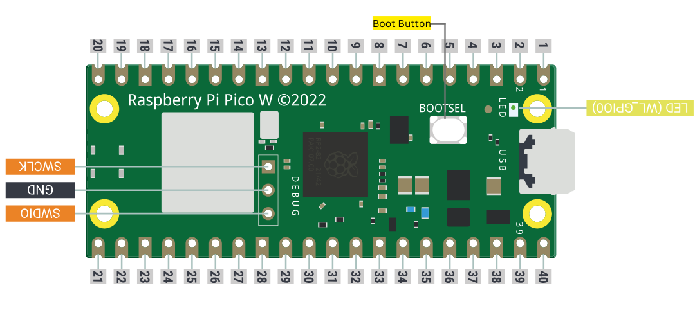

<h1 align="center">pirate-ducky</h1>

<div align="center">
  <strong>Rubber Ducky Installation Simplified: Create a cheap but powerful &amp; custom USB Rubber Ducky with a Raspberry Pi Pico/Pico W</strong>
</div>

<br />

<div align="center">
  
  
  <a href="https://github.com/RubberPirate/pirate-ducky/graphs/contributors"></a>
  
  
</div>

<br />

## Table of contents
- [Requirements](#requirements)
- [Installation](#installation-instructions)
  - [Setup mode](#setup-mode)
  - [USB mode enable/disable](#usb-mode-enable-disable)
  - [Multiple payloads](#multiple-payloads)
- [Changing Keyboard Layouts](#changing-keyboard-layouts)
- [Pico Recovery](#how-to-recover-your-pico-if-it-becomes-corrupted-or-doesnt-boot)
- [Links and Resources](#useful-links-and-resources)

# Requirements

1. Raspberry Pi Pico / Raspberry Pi Pico W (preferred)

2. Micro B to USB A male converter / Micro USB cable



# Installation Instructions

1. Clone the repo to get a local copy of the files. `git clone https://github.com/RubberPirate/pirate-ducky.git` or Download the repo

2. Plug the device using a converter/cable into a USB port while holding the Boot button. It will show up as a removable media device named `RPI-RP2`.

3. Copy the `.uf2` file from `pirate-ducky/CircuitPython` (cloned files)  
   pico.uf2 - Raspberry Pi Pico  
   pico-w.uf2 - Raspberry Pi Pico W  

5. Paste it to the root of the Pico (`RPI-RP2`). The device will reboot and after a second or so, it will reconnect as `CIRCUITPY`.

5. Navigate to `pirate-ducky/lib` and copy all the files to the `lib` folder on your Raspberry Pi Pico.

6. Navigate to `pirate-ducky/ducky` and copy all the files to the root of your Pico.

7. *For Pico W Only* Copy the `secrets.py` file from `pirate-ducky/secrets` (clone) to the root of your pico. This contains the AP name and password to be created by the Pico W.
   `ssid : BadAPName`
   `password : badpassword`

8. Find a script from `pirate-ducky/payloads` (some scripts needs modifications to run, so edit them before executing) or [create your own one using Ducky Script](https://docs.hak5.org/hak5-usb-rubber-ducky/ducky-script-basics/hello-world) and save it as `payload.dd` in the Pico. Currently, pirate-ducky only supports DuckyScript 1.0, not 3.0.

9. Be careful, if your device isn't in [setup mode](#setup-mode), the device will reboot and after half a second, the script will run.

10. **Please note:** by default Pico W will not show as a USB drive


## Setup mode

To edit the payload, enter setup mode by connecting the pin 1 (`GP0`) to pin 3 (`GND`), this will stop the pirate-ducky from injecting the payload in your own machine.
The easiest way to do so is by using a jumper wire between those pins as seen bellow.


## USB mode enable-disable

Pico: The default mode is USB mass storage enabled.   
Pico W: The default mode is USB mass storage **disabled**  

*For Pico Only*
If you need the pirate-ducky to not show up as a USB mass storage device for stealth, follow these instructions.  
- Enter setup mode.    
- Copy your payload script to the pirate-ducky.  
- Disconnect the pico from your host PC.
- Connect a jumper wire between pin 18 (`GND`) and pin 20 (`GPIO15`).  
This will prevent the pirate-ducky from showing up as a USB drive when plugged into the target computer.  
- Remove the jumper and reconnect to your PC to reprogram.  


## Multiple payloads

Multiple payloads can be stored on the Pico and Pico W.  
To select a payload, ground one of these pins:
- GP4 - payload.dd
- GP5 - payload2.dd
- GP10 - payload3.dd
- GP11 - payload4.dd


## Changing Keyboard Layouts

#### How to use one of these layouts with the pirate-ducky repository.

**Go to the [latest release page](https://github.com/Neradoc/Circuitpython_Keyboard_Layouts/releases/latest), look if your language is in the list.**

#### If your language/layout is in the bundle

Download the `py` zip, named `circuitpython-keyboard-layouts-py-XXXXXXXX.zip`

**NOTE: You can use the mpy version targetting the version of Circuitpython that is on the device, but on Raspberry Pi Pico you don't need it - they only reduce file size and memory use on load, which the pico has plenty of.**

#### If your language/layout is not in the bundle

Try the online generator, it should get you a zip file with the bundles for yout language

https://www.neradoc.me/layouts/

#### Now you have a zip file

#### Find your language/layout in the lib directory

For a language `LANG`, copy the following files from the zip's `lib` folder to the `lib` directory of the pico.    

- `keyboard_layout_win_LANG.py`
- `keycode_win_LANG.py`
Replace `LANG` with the letters for your language of choice.

This is what it should look like **if your language is French for example**.


#### Modify the pirate-ducky code to use your language file:

At the start of the file comment out these lines:

```py
from adafruit_hid.keyboard_layout_us import KeyboardLayoutUS as KeyboardLayout
from adafruit_hid.keycode import Keycode
```

And Write these lines:  
```py
from keyboard_layout_win_LANG import KeyboardLayout
from keycode_win_LANG import Keycode
```
*Replace `LANG` with the letters for your language of choice. The name must match the file (without the py or mpy extension).*

##### Example:  Set to German Keyboard (WIN_DE)

```py
from keyboard_layout_win_de import KeyboardLayout
from keycode_win_de import Keycode
```


## How to recover your Pico if it becomes corrupted or doesnt boot

1. Plug the device using a converter/cable into a USB port while holding the Boot button. It will show up as a removable media device named `RPI-RP2`.

2. Copy the `flash_nuke.uf2` file from `pirate-ducky/reset` (cloned files)  
 
3. Paste it to the root of the Pico (`RPI-RP2`). The device will reboot and after a second or so, it will reconnect as `RPI-RP2`.


## Useful links and resources

### Docs

[CircuitPython](https://circuitpython.readthedocs.io/en/6.3.x/README.html)

[CircuitPython HID](https://learn.adafruit.com/circuitpython-essentials/circuitpython-hid-keyboard-and-mouse)

[Ducky Script](https://github.com/hak5darren/USB-Rubber-Ducky/wiki/Duckyscript)
